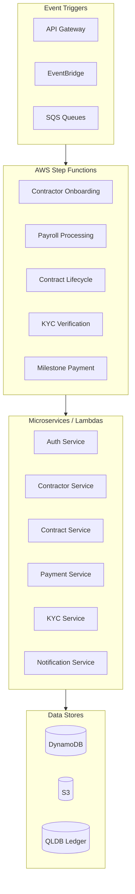
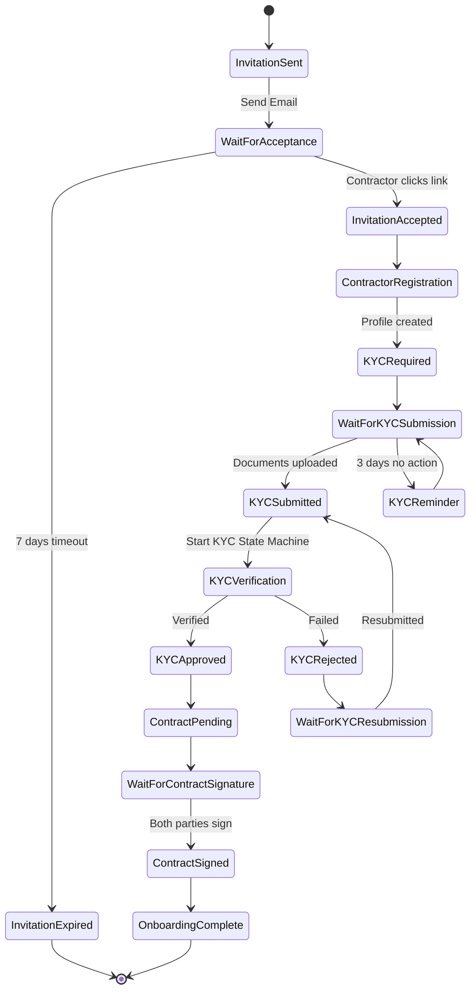
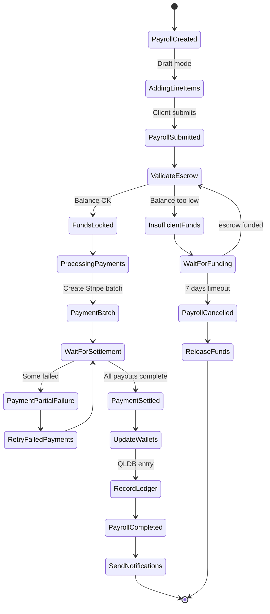
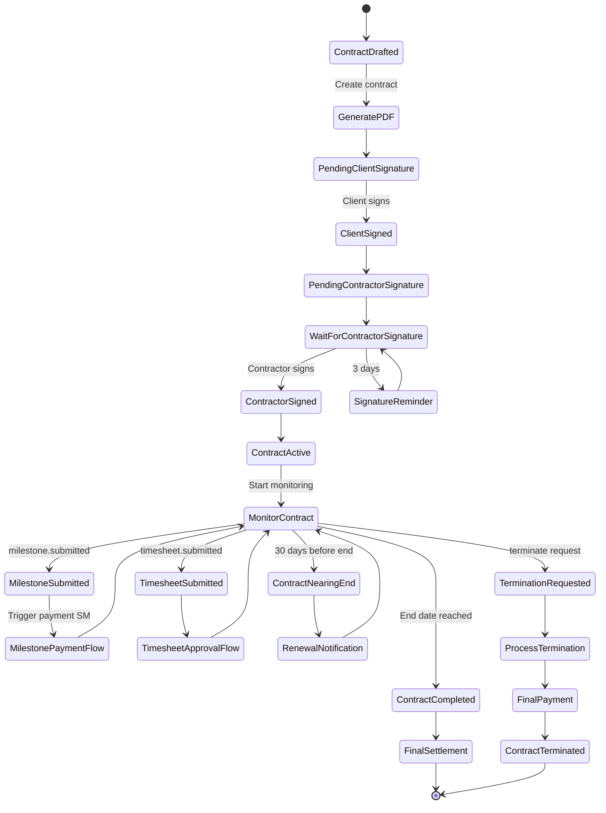
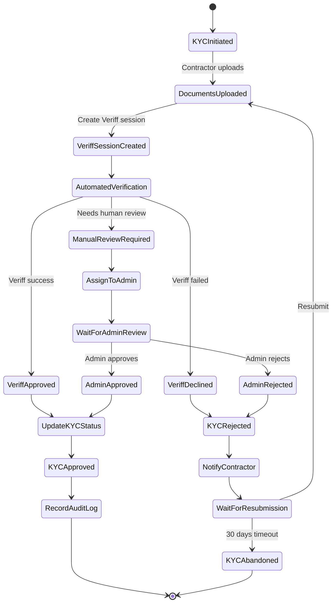
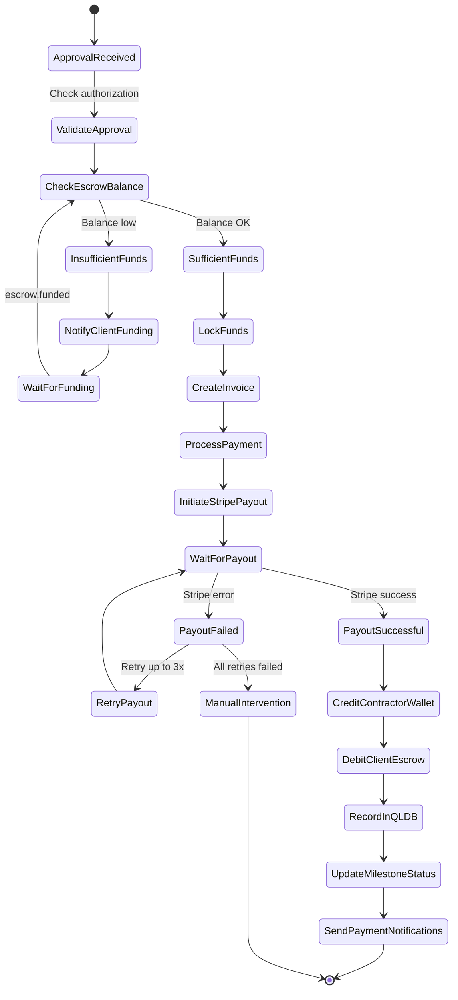

# AWS Step Functions State Machine

Implementation

## Architecture Overview

AWS Step Functions will orchestrate all long-running business workflows across your microservices. Each state machine coordinates Lambda functions, service integrations, and human approval steps.



---

## State Machine 1: Contractor Onboarding

**Trigger:** `POST /api/clients/me/contractors/invite`**Duration:** Days to weeks



**States and Events:**| State | Event In | Actions | Event Out ||-------|----------|---------|-----------|| `InvitationSent` | API call | Save invitation, generate token | `invitation.sent` || `WaitForAcceptance` | - | Wait with 7-day timeout | - || `InvitationAccepted` | `invitation.accepted` | Update status | `contractor.registration.started` || `ContractorRegistration` | - | Create contractor profile | `contractor.profile.created` || `KYCRequired` | - | Trigger KYC notification | `kyc.required` || `KYCSubmitted` | `kyc.documents.uploaded` | Start verification | `kyc.verification.started` || `KYCApproved` | `kyc.approved` | Update contractor status | `contractor.kyc.approved` || `ContractPending` | - | Generate contract PDF | `contract.pending.signature` || `ContractSigned` | `contract.signed.both` | Activate contract | `contractor.onboarding.complete` |---

## State Machine 2: Payroll Processing

**Trigger:** `POST /api/clients/me/payroll/:id/process`**Duration:** Hours to days (includes payment settlement)



**States and Events:**| State | Event In | Actions | Event Out ||-------|----------|---------|-----------|| `PayrollCreated` | API call | Create payroll record | `payroll.created` || `PayrollSubmitted` | `payroll.submitted` | Lock for processing | `payroll.submitted` || `ValidateEscrow` | - | Check client escrow balance | - || `FundsLocked` | - | Reserve funds in escrow | `escrow.funds.locked` || `ProcessingPayments` | - | Initiate Stripe payouts | `payments.processing` || `WaitForSettlement` | - | Poll/webhook for Stripe status | - || `PaymentSettled` | `stripe.payout.completed` | Mark payments complete | `payments.settled` || `UpdateWallets` | - | Credit contractor wallets | `wallets.credited` || `RecordLedger` | - | Write to QLDB | `ledger.recorded` || `PayrollCompleted` | - | Update payroll status | `payroll.completed` |---

## State Machine 3: Contract Lifecycle

**Trigger:** `POST /api/clients/me/contracts`**Duration:** Months (entire contract duration)



**Key Events:**

- `contract.created` - New contract drafted
- `contract.signed.client` - Client signature captured
- `contract.signed.contractor` - Contractor signature captured
- `contract.activated` - Both signatures, contract active
- `contract.milestone.submitted` - Work submitted for review
- `contract.terminated` - Early termination
- `contract.completed` - Natural end

---

## State Machine 4: KYC Verification

**Trigger:** `kyc.documents.uploaded` event or API call**Duration:** Hours to days



**Integration Points:**

- **Veriff API** - Automated identity verification
- **Admin Dashboard** - Manual review queue via callback token
- **S3** - Document storage
- **DynamoDB** - KYC session and document status

---

## State Machine 5: Milestone/Timesheet Payment

**Trigger:** `milestone.approved` or `timesheet.approved` event**Duration:** Minutes to hours



---

## Infrastructure Components

### Required AWS Resources

| Resource | Purpose ||----------|---------|| **Step Functions State Machines** | 5 state machines (one per workflow) || **Lambda Functions** | Individual task handlers (15-20 functions) || **EventBridge** | Event routing and triggers || **SQS Queues** | Dead letter queues, async processing || **DynamoDB Tables** | Execution state, idempotency keys || **IAM Roles** | Step Functions execution roles || **CloudWatch** | Logging, metrics, alarms || **SNS Topics** | Human approval callbacks |

### Terraform Module Structure

```javascript
infrastructure/
├── modules/
│   └── step-functions/
│       ├── main.tf
│       ├── variables.tf
│       ├── outputs.tf
│       ├── iam.tf
│       └── state-machines/
│           ├── contractor-onboarding.asl.json
│           ├── payroll-processing.asl.json
│           ├── contract-lifecycle.asl.json
│           ├── kyc-verification.asl.json
│           └── milestone-payment.asl.json
└── environments/
    ├── dev/
    └── prod/
```


### Lambda Functions to Create

| Function | State Machine | Purpose ||----------|--------------|---------|| `sendInvitationEmail` | Onboarding | Send contractor invitation || `createContractorProfile` | Onboarding | Initialize contractor record || `validateEscrowBalance` | Payroll, Milestone | Check client funds || `lockEscrowFunds` | Payroll, Milestone | Reserve payment amount || `initiateStripePayout` | Payroll, Milestone | Call Stripe API || `creditContractorWallet` | Payroll, Milestone | Update wallet balance || `recordQLDBTransaction` | Payroll, Milestone | Immutable ledger entry || `createVeriffSession` | KYC | Start Veriff verification || `processVeriffWebhook` | KYC | Handle Veriff callbacks || `generateContractPDF` | Contract | Create PDF document || `sendNotification` | All | Generic notification sender |---

## EventBridge Event Schema

All events follow this structure:

```json
{
  "version": "1.0",
  "id": "uuid",
  "source": "mindlinks.{service-name}",
  "detail-type": "{entity}.{action}",
  "time": "ISO8601",
  "detail": {
    "entityId": "uuid",
    "entityType": "contractor|contract|payroll|kyc",
    "action": "created|updated|approved|rejected",
    "actorId": "uuid",
    "actorType": "client|contractor|admin|system",
    "metadata": {}
  }
}
```

---

## Implementation Steps

### Phase 1: Foundation (Week 1)

- Set up Terraform module for Step Functions
- Create IAM roles and policies
- Set up EventBridge event bus
- Create base Lambda function structure

### Phase 2: KYC Verification (Week 2)

- Implement KYC state machine (simplest, standalone)
- Integrate with Veriff API
- Add admin review callback mechanism
- Test end-to-end flow

### Phase 3: Contractor Onboarding (Week 3)

- Implement onboarding state machine
- Integrate with KYC state machine (nested execution)
- Add invitation flow with timeouts
- Test full onboarding journey

### Phase 4: Contract Lifecycle (Week 4)

- Implement contract state machine
- Add milestone/timesheet monitoring
- Integrate with payment flows
- Test contract scenarios

### Phase 5: Payment Flows (Week 5)

- Implement payroll processing state machine
- Implement milestone payment state machine
- Integrate with Stripe
- Add QLDB recording
- Test payment scenarios

### Phase 6: Integration & Monitoring (Week 6)

- Connect all state machines via EventBridge
- Set up CloudWatch dashboards
- Add alerting for failures
- Performance testing
- Documentation

---

## Key Files to Create