# Mind-Links Backend Microservices Architecture - Visualization Diagrams

## Overview

This document contains comprehensive visualization diagrams for the Mind-Links backend microservices architecture integrated with AWS infrastructure. The architecture consists of 8 independent microservices deployed on AWS ECS Fargate with API Gateway, service discovery, and distributed data storage.

---

## 1. Complete System Architecture

```mermaid
graph TB
    subgraph "Frontend Layer"
        CD[Client Dashboard<br/>Next.js]
        COD[Contractor Dashboard<br/>Next.js]
        AD[Admin Dashboard<br/>Next.js]
    end

    subgraph "API Gateway Layer"
        AG[AWS API Gateway<br/>REST API<br/>api.mindlinks.com]
    end

    subgraph "Load Balancer"
        ALB[Application Load Balancer<br/>Internal Routing]
    end

    subgraph "Microservices Layer - ECS Fargate"
        AS[Auth Service<br/>:3001<br/>ECS: auth-service]
        US[User Service<br/>:3002<br/>ECS: user-service]
        CS[Client Service<br/>:3003<br/>ECS: client-service]
        COS[Contractor Service<br/>:3004<br/>ECS: contractor-service]
        KS[KYC Service<br/>:3005<br/>ECS: kyc-service]
        CTS[Contract Service<br/>:3006<br/>ECS: contract-service]
        SS[Signature Service<br/>:3007<br/>ECS: signature-service]
        LS[Ledger Service<br/>:3008<br/>ECS: ledger-service]
        PS[Payment Service<br/>:3009<br/>ECS: payment-service]
        NS[Notification Service<br/>:3010<br/>ECS: notification-service]
        ADS[Admin Service<br/>:3011<br/>ECS: admin-service]
    end

    subgraph "Service Discovery"
        SD[AWS Cloud Map<br/>Service Registry<br/>mindlinks.internal]
    end

    subgraph "Event Bus"
        EB[AWS EventBridge<br/>Event-Driven Communication]
    end

    subgraph "Data Layer"
        subgraph "DynamoDB Tables"
            DBA[auth-users<br/>auth-sessions]
            DBU[user-profiles<br/>user-preferences]
            DBC[client-companies<br/>client-invitations]
            DBCO[contractor-profiles<br/>contractor-bank-details]
            DBK[kyc-sessions<br/>kyc-documents]
            DBCT[contract-contracts<br/>contract-templates]
            DBP[payment-transactions<br/>payment-escrow]
            DBN[notification-notifications<br/>notification-templates]
        end
        QLDB[Amazon QLDB<br/>Immutable Ledger<br/>contract-signatures<br/>contract-activations]
        REDIS[ElastiCache Redis<br/>Sessions & Cache]
        S3[AWS S3<br/>Document Storage<br/>Contracts & KYC Docs]
    end

    subgraph "External Services"
        VERIFF[Veriff/Onfido<br/>KYC Verification]
        STRIPE[Stripe<br/>Payment Processing]
        SENDGRID[SendGrid<br/>Email Notifications]
        OPCORP[OpenCorporates<br/>Business Registry]
    end

    subgraph "Monitoring & Observability"
        CW[CloudWatch<br/>Logs & Metrics]
        XRAY[AWS X-Ray<br/>Distributed Tracing]
    end

    CD --> AG
    COD --> AG
    AD --> AG

    AG --> ALB
    ALB --> AS
    ALB --> US
    ALB --> CS
    ALB --> COS
    ALB --> KS
    ALB --> CTS
    ALB --> SS
    ALB --> LS
    ALB --> PS
    ALB --> NS
    ALB --> ADS

    AS -.-> SD
    US -.-> SD
    CS -.-> SD
    COS -.-> SD
    KS -.-> SD
    CTS -.-> SD
    SS -.-> SD
    LS -.-> SD
    PS -.-> SD
    NS -.-> SD
    ADS -.-> SD

    AS --> DBA
    US --> DBU
    CS --> DBC
    COS --> DBCO
    KS --> DBK
    CTS --> DBCT
    PS --> DBP
    NS --> DBN

    AS --> REDIS
    NS --> REDIS

    SS --> QLDB
    LS --> QLDB

    KS --> S3
    CTS --> S3

    KS --> VERIFF
    PS --> STRIPE
    NS --> SENDGRID
    CS --> OPCORP

    AS --> EB
    US --> EB
    CS --> EB
    COS --> EB
    KS --> EB
    CTS --> EB
    SS --> EB
    LS --> EB
    PS --> EB
    NS --> EB

    AS --> CW
    US --> CW
    CS --> CW
    COS --> CW
    KS --> CW
    CTS --> CW
    SS --> CW
    LS --> CW
    PS --> CW
    NS --> CW
    ADS --> CW

    AS --> XRAY
    US --> XRAY
    CS --> XRAY
    CTS --> XRAY
    PS --> XRAY
```

---

## 2. Service Communication Flow

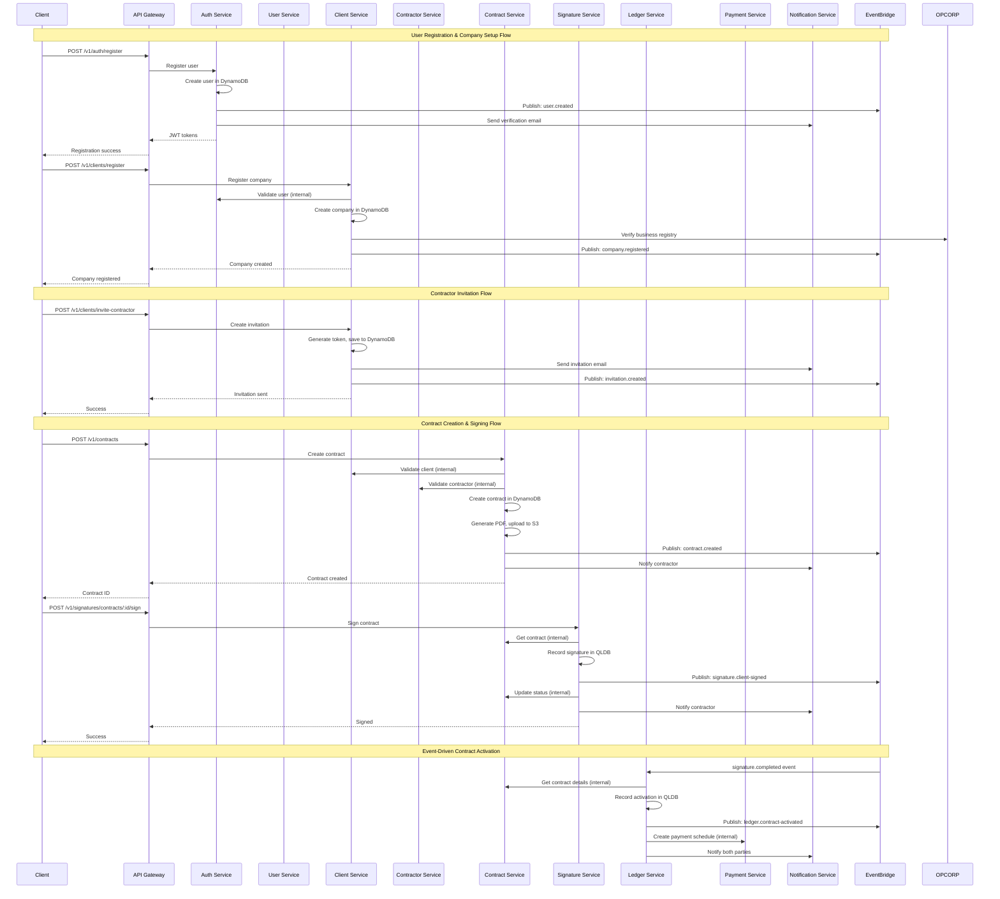

---

## 3. Infrastructure Components

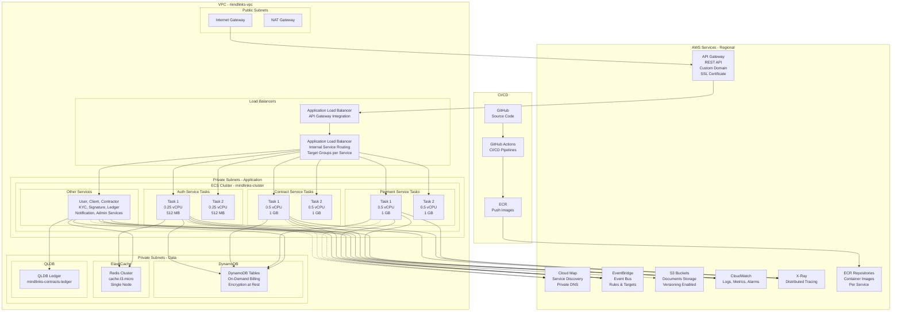

---

## 4. Service-to-Service Communication Patterns

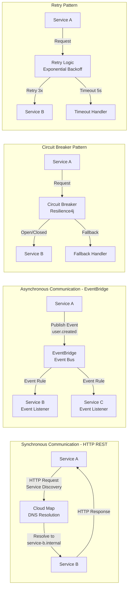

---

## 5. Data Flow - Contract Creation to Activation

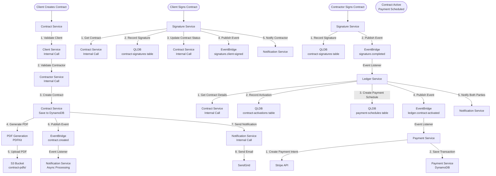

---

## 6. Authentication & Authorization Flow

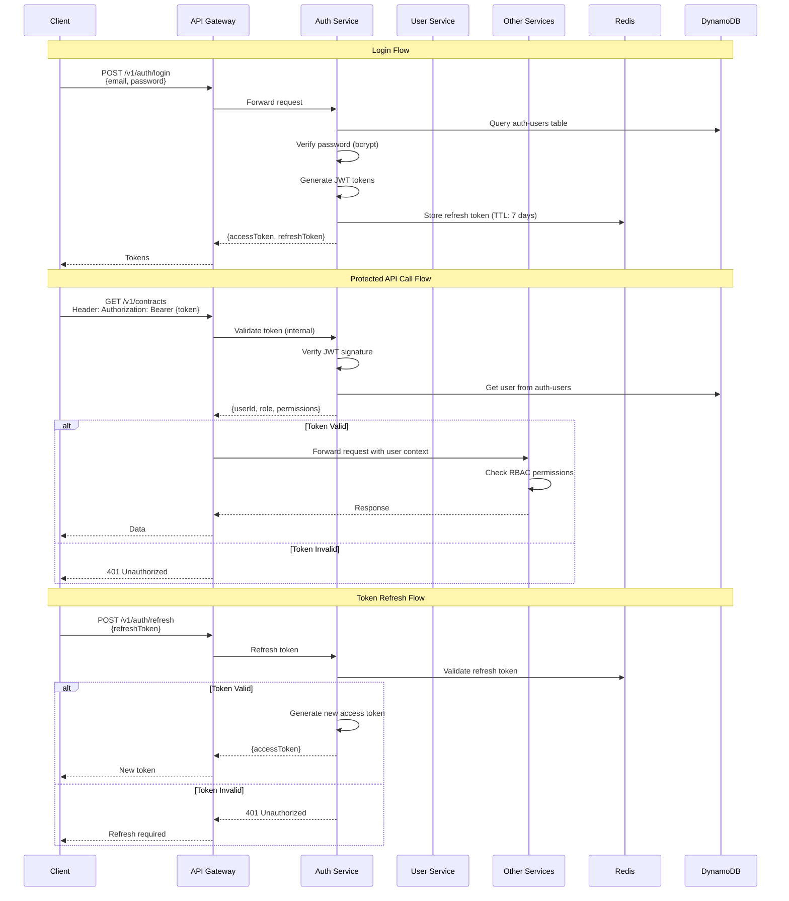

---

## 7. Deployment Architecture

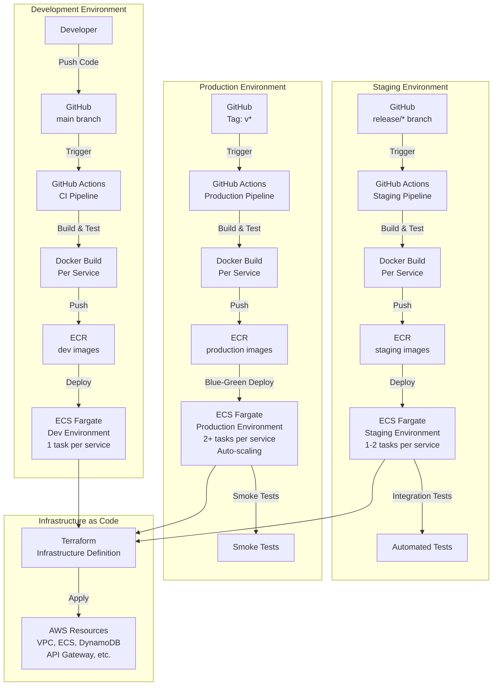

---

## 8. Monitoring & Observability

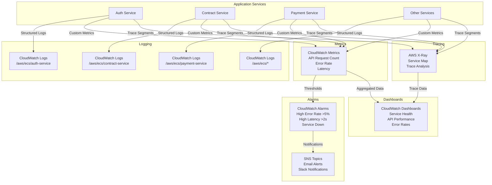

---

## 9. Security Architecture

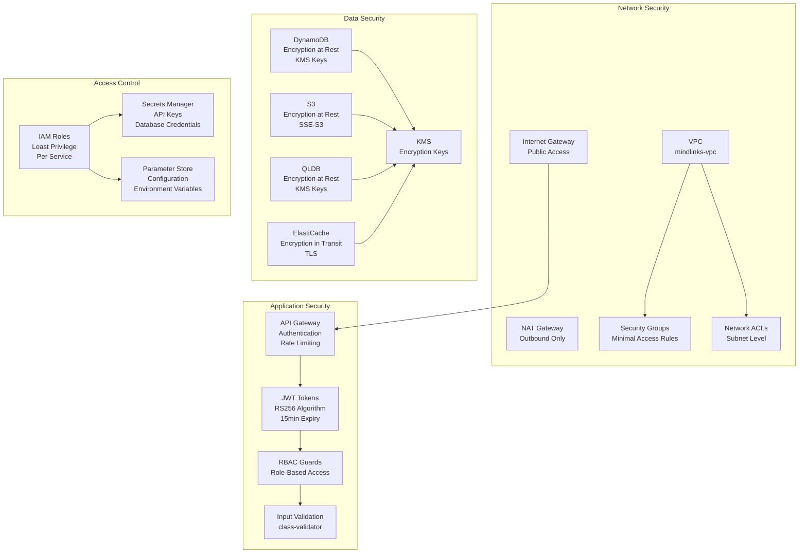

---

## 10. Service Dependencies Graph

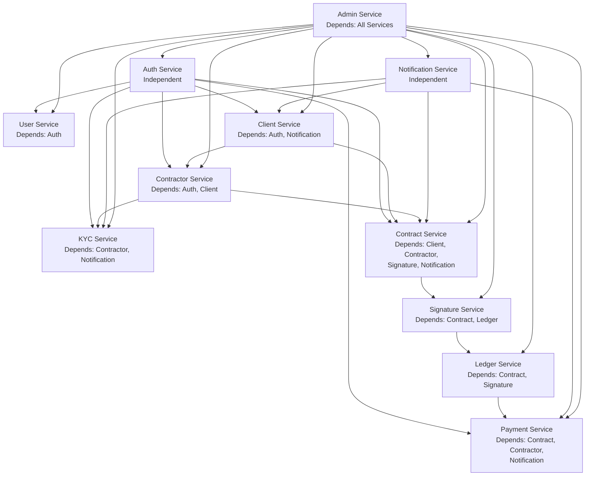

---

## 11. Event-Driven Architecture

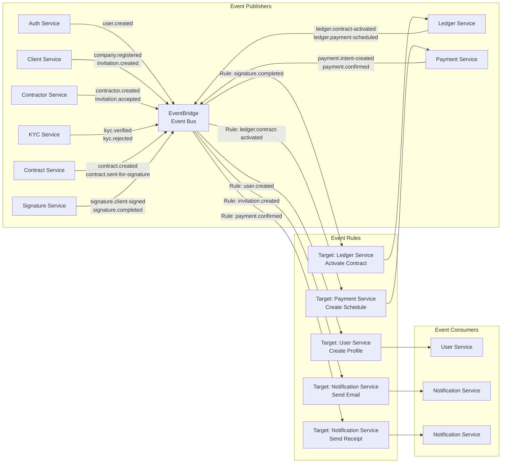

---

## 12. Scalability & Auto-Scaling

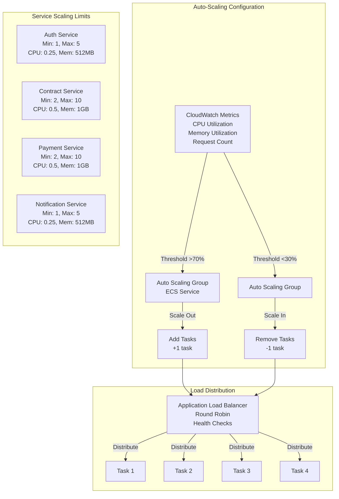

---

## Key Architecture Highlights

### Service Independence
- Each microservice is independently deployable
- Own database tables (DynamoDB)
- Separate ECS Fargate service
- Independent scaling policies

### Communication Patterns
- **Synchronous**: HTTP REST via Service Discovery
- **Asynchronous**: EventBridge for event-driven flows
- **Circuit Breaker**: Resilience patterns for fault tolerance
- **Retry Logic**: Exponential backoff for transient failures

### Infrastructure Components
- **API Gateway**: Single entry point for external requests
- **Service Discovery**: AWS Cloud Map for internal routing
- **Load Balancer**: ALB for service-to-service communication
- **Event Bus**: EventBridge for decoupled communication

### Data Storage
- **DynamoDB**: Operational data (per-service tables)
- **QLDB**: Immutable audit ledger (signatures, activations)
- **Redis**: Session storage and caching
- **S3**: Document storage (contracts, KYC docs)

### Observability
- **CloudWatch**: Logs, metrics, alarms
- **X-Ray**: Distributed tracing across services
- **Dashboards**: Service health and performance monitoring

### Security
- **Network**: VPC with private subnets, security groups
- **Authentication**: JWT tokens with RBAC
- **Encryption**: KMS for data at rest, TLS for data in transit
- **IAM**: Least privilege access per service

---

**Document Version:** 1.0  
**Last Updated:** 2025-01-XX  
**Architecture Type:** Full Microservices on AWS

