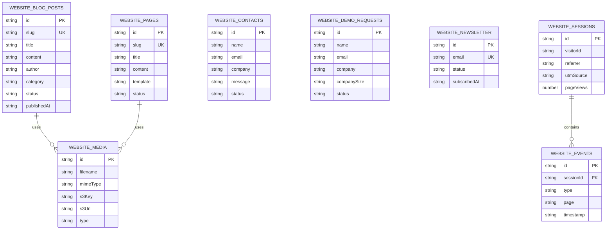

# Mind-Links Platform - Complete Database ERD

## Full Platform Entity Relationship Diagram

> **Note:** Due to the large number of tables (37+), the ERD is split into logical sections below. Each section can be rendered independently.

---

## 1. Core Authentication & User Management


---

## 2. Client & Contractor Details


---

## 3. KYC & Compliance


---

## 4. Contracts & Work Tracking


---

## 5. Payments & Financial


---

## 6. Admin & Audit

```mermaid
erDiagram
    ADMIN_USERS {
        string id PK
        string email UK
        string name
        string role
        string status
        boolean mfaEnabled
        string createdBy FK
    }

    ADMIN_COUNTRY_RULES {
        string countryCode PK
        string countryName
        string currency
        boolean isActive
        string updatedBy FK
    }

    ADMIN_SYSTEM_ALERTS {
        string id PK
        string type
        string title
        string message
        boolean resolved
        string resolvedBy FK
    }

    AUDIT_LOGS {
        string id PK
        string timestamp SK
        string adminId FK
        string action
        string entityType
        string entityId
        string ipAddress
    }

    AUDIT_EVENTS {
        string id PK
        string timestamp SK
        string eventType
        string severity
        string message
        boolean resolved
    }

    QLDB_LEDGER {
        string id PK
        string transactionType
        string adminId FK
        string contractorId FK
        number amount
        number balanceBefore
        number balanceAfter
        string reason
    }

    ADMIN_USERS ||--o{ AUDIT_LOGS : "creates"
    ADMIN_USERS ||--o{ QLDB_LEDGER : "authorizes"
    ADMIN_USERS ||--o{ ADMIN_SYSTEM_ALERTS : "resolves"
    ADMIN_USERS ||--o{ ADMIN_COUNTRY_RULES : "updates"
```

---

## 7. Notifications


---

## 8. Website Backend



---

## 9. Complete Platform Overview (Simplified)


---

## Table Summary

| # | Service | Table Name | Primary Key |
|---|---------|------------|-------------|
| 1 | Auth | `auth-users` | id (UUID) |
| 2 | Auth | `auth-sessions` | id (UUID) |
| 3 | Auth | `auth-password-resets` | id (UUID) |
| 4 | Client | `client-companies` | id (UUID) |
| 5 | Client | `client-documents` | id (UUID) |
| 6 | Client | `client-invitations` | id (UUID) |
| 7 | Contractor | `contractor-profiles` | id (UUID) |
| 8 | Contractor | `contractor-bank-details` | id (UUID) |
| 9 | Contractor | `contractor-tax-info` | id (UUID) |
| 10 | Contractor | `contractor-wallet` | id (UUID) |
| 11 | KYC | `kyc-sessions` | id (UUID) |
| 12 | KYC | `kyc-documents` | id (UUID) |
| 13 | Contract | `contract-contracts` | id (UUID) |
| 14 | Contract | `contract-milestones` | id (UUID) |
| 15 | Contract | `contract-timesheets` | id (UUID) |
| 16 | Payment | `payment-escrow` | id (UUID) |
| 17 | Payment | `payment-payroll` | id (UUID) |
| 18 | Payment | `payment-payroll-items` | id (UUID) |
| 19 | Payment | `payment-invoices` | id (UUID) |
| 20 | Payment | `payment-withdrawals` | id (UUID) |
| 21 | Payment | `payment-transactions` | id (UUID) |
| 22 | Admin | `admin-users` | id (UUID) |
| 23 | Admin | `admin-country-rules` | countryCode |
| 24 | Admin | `admin-system-alerts` | id (UUID) |
| 25 | Audit | `audit-logs` | id + timestamp |
| 26 | Audit | `audit-events` | id + timestamp |
| 27 | Audit | `qldb-ledger` | QLDB (immutable) |
| 28 | Notification | `notification-notifications` | id (UUID) |
| 29 | Notification | `notification-preferences` | id (UUID) |
| 30 | Website | `website-blog-posts` | id (UUID) |
| 31 | Website | `website-pages` | id (UUID) |
| 32 | Website | `website-media` | id (UUID) |
| 33 | Website | `website-contacts` | id (UUID) |
| 34 | Website | `website-demo-requests` | id (UUID) |
| 35 | Website | `website-newsletter` | id (UUID) |
| 36 | Website | `website-sessions` | id (UUID) |
| 37 | Website | `website-events` | id (UUID) |

---

## Quick Stats

| Metric | Count |
|--------|-------|
| **Total DynamoDB Tables** | 37 |
| **AWS QLDB Ledger** | 1 |
| **Microservices** | 10 |
| **User Roles** | 3 (Client, Contractor, Admin) |

---

**Document Version:** 1.0  
**Last Updated:** 2025
