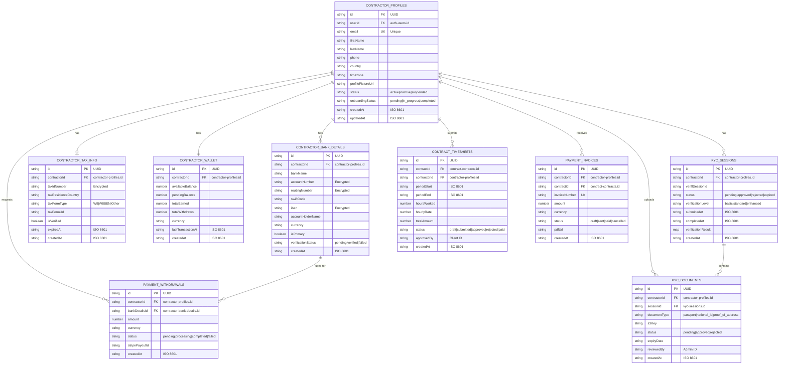

# Contractor Dashboard Backend Plan

## Overview

This document provides a comprehensive backend plan for the **Contractor Dashboard** in the Mind-Links platform. The contractor dashboard is the primary interface for contractors to manage their profiles, view contracts, track earnings, submit timesheets, manage invoices, and handle payments.

---

## Table of Contents

1. [Dashboard Features](#dashboard-features)
2. [Microservices Architecture](#microservices-architecture)
3. [API Endpoints](#api-endpoints)
4. [DynamoDB Schemas](#dynamodb-schemas)
5. [Service Integration](#service-integration)
6. [Infrastructure](#infrastructure)
7. [Security & Authorization](#security--authorization)
8. [Implementation Timeline](#implementation-timeline)

---

## Dashboard Features

### Core Features for Contractors

| Feature | Description | Priority |
|---------|-------------|----------|
| **Profile Management** | View/edit personal info, bank details, tax info | P0 |
| **KYC Status** | View verification status, upload documents | P0 |
| **Contracts** | View active/pending contracts, sign contracts | P0 |
| **Earnings Dashboard** | Total earned, pending, available balance | P0 |
| **Timesheets** | Submit/view timesheets for hourly contracts | P1 |
| **Invoices** | View/download invoices, payment history | P1 |
| **Wallet & Withdrawals** | View balance, request withdrawals | P1 |
| **Notifications** | Contract updates, payment notifications | P2 |
| **Documents** | Store/download tax forms, contracts | P2 |

### Dashboard Sections

```
┌─────────────────────────────────────────────────────────────────────┐
│                     CONTRACTOR DASHBOARD                            │
├─────────────────────────────────────────────────────────────────────┤
│  ┌─────────────┐  ┌─────────────┐  ┌─────────────┐  ┌─────────────┐ │
│  │   Profile   │  │   Earnings  │  │  Contracts  │  │   Wallet    │ │
│  │   Status    │  │   Summary   │  │    List     │  │   Balance   │ │
│  └─────────────┘  └─────────────┘  └─────────────┘  └─────────────┘ │
├─────────────────────────────────────────────────────────────────────┤
│                                                                      │
│  ┌──────────────────────────────────────────────────────────────┐   │
│  │                    ACTIVE CONTRACTS                           │   │
│  │  ┌─────────────────────┐  ┌─────────────────────┐            │   │
│  │  │ Contract #1         │  │ Contract #2         │            │   │
│  │  │ Client: ABC Corp    │  │ Client: XYZ Ltd     │            │   │
│  │  │ Type: Fixed         │  │ Type: Hourly        │            │   │
│  │  │ Rate: $5,000/mo     │  │ Rate: $50/hr        │            │   │
│  │  │ Status: Active      │  │ Status: Pending     │            │   │
│  │  └─────────────────────┘  └─────────────────────┘            │   │
│  └──────────────────────────────────────────────────────────────┘   │
│                                                                      │
│  ┌──────────────────────────────────────────────────────────────┐   │
│  │                      RECENT ACTIVITY                          │   │
│  │  • Payment received: $5,000 from ABC Corp                    │   │
│  │  • Contract signed: XYZ Ltd - Web Development                │   │
│  │  • Timesheet approved: Week of Nov 25                        │   │
│  └──────────────────────────────────────────────────────────────┘   │
└─────────────────────────────────────────────────────────────────────┘
```

---

## Microservices Architecture

### Services Involved

The Contractor Dashboard interacts with **6 microservices**:

```
┌─────────────────────────────────────────────────────────────────────┐
│                     CONTRACTOR DASHBOARD                            │
│                        (Frontend)                                   │
└─────────────────────┬───────────────────────────────────────────────┘
                      │
                      ▼
┌─────────────────────────────────────────────────────────────────────┐
│                      API GATEWAY                                    │
│               (AWS API Gateway / ALB)                               │
└─────────────────────┬───────────────────────────────────────────────┘
                      │
        ┌─────────────┼─────────────┬─────────────┬─────────────┐
        │             │             │             │             │
        ▼             ▼             ▼             ▼             ▼
┌───────────┐ ┌───────────┐ ┌───────────┐ ┌───────────┐ ┌───────────┐
│   Auth    │ │Contractor │ │ Contract  │ │  Payment  │ │Notification│
│  Service  │ │  Service  │ │  Service  │ │  Service  │ │  Service  │
│   :3001   │ │   :3004   │ │   :3006   │ │   :3008   │ │   :3010   │
└───────────┘ └───────────┘ └───────────┘ └───────────┘ └───────────┘
        │             │             │             │             │
        ▼             ▼             ▼             ▼             ▼
┌─────────────────────────────────────────────────────────────────────┐
│                        DynamoDB Tables                              │
│  auth-users, contractor-profiles, contract-contracts, payments, etc │
└─────────────────────────────────────────────────────────────────────┘
```

### Service Responsibilities

| Service | Port | Responsibilities for Contractor Dashboard |
|---------|------|------------------------------------------|
| **Auth Service** | 3001 | Login, JWT validation, password reset |
| **Contractor Service** | 3004 | Profile management, bank details, documents |
| **KYC Service** | 3005 | KYC status, document verification |
| **Contract Service** | 3006 | Contract list, signing, details |
| **Payment Service** | 3008 | Earnings, invoices, withdrawals |
| **Notification Service** | 3010 | In-app notifications, email alerts |

---

## API Endpoints

### 1. Contractor Service (Port 3004)

#### Profile Management

```yaml
# Get contractor profile
GET /api/contractors/me
Headers:
  Authorization: Bearer <jwt_token>
Response:
  {
    "id": "uuid",
    "userId": "uuid",
    "name": "John Doe",
    "email": "john@example.com",
    "phone": "+1234567890",
    "country": "Egypt",
    "timezone": "Africa/Cairo",
    "avatarUrl": "https://s3.../avatar.jpg",
    "kycStatus": "verified",
    "onboardingCompleted": true,
    "createdAt": "2024-01-01T00:00:00Z",
    "updatedAt": "2024-01-15T00:00:00Z"
  }

# Update contractor profile
PUT /api/contractors/me
Headers:
  Authorization: Bearer <jwt_token>
Body:
  {
    "name": "John Doe Updated",
    "phone": "+1234567890",
    "timezone": "Africa/Cairo"
  }
Response:
  {
    "id": "uuid",
    "name": "John Doe Updated",
    ...
  }

# Upload avatar
POST /api/contractors/me/avatar
Headers:
  Authorization: Bearer <jwt_token>
  Content-Type: multipart/form-data
Body:
  file: <image_file>
Response:
  {
    "avatarUrl": "https://s3.../avatar.jpg"
  }
```

#### Bank Details

```yaml
# Get bank details
GET /api/contractors/me/bank-details
Headers:
  Authorization: Bearer <jwt_token>
Response:
  {
    "id": "uuid",
    "bankName": "National Bank of Egypt",
    "accountNumber": "****1234",  # Masked
    "routingNumber": "****5678",   # Masked
    "currency": "USD",
    "status": "verified",
    "createdAt": "2024-01-01T00:00:00Z"
  }

# Create/Update bank details
PUT /api/contractors/me/bank-details
Headers:
  Authorization: Bearer <jwt_token>
Body:
  {
    "bankName": "National Bank of Egypt",
    "accountNumber": "123456789012",
    "routingNumber": "123456789",
    "currency": "USD"
  }
Response:
  {
    "id": "uuid",
    "bankName": "National Bank of Egypt",
    "accountNumber": "****9012",
    "routingNumber": "****6789",
    "currency": "USD",
    "status": "pending_verification"
  }
```

#### Tax Information

```yaml
# Get tax information
GET /api/contractors/me/tax-info
Headers:
  Authorization: Bearer <jwt_token>
Response:
  {
    "id": "uuid",
    "taxId": "123-45-6789",
    "taxCountry": "Egypt",
    "taxFormType": "W-8BEN",
    "taxFormUrl": "https://s3.../w8ben.pdf",
    "status": "submitted",
    "submittedAt": "2024-01-01T00:00:00Z"
  }

# Submit tax form
POST /api/contractors/me/tax-info
Headers:
  Authorization: Bearer <jwt_token>
  Content-Type: multipart/form-data
Body:
  taxId: "123-45-6789"
  taxCountry: "Egypt"
  taxForm: <pdf_file>
Response:
  {
    "id": "uuid",
    "taxId": "123-45-6789",
    "taxCountry": "Egypt",
    "taxFormUrl": "https://s3.../w8ben.pdf",
    "status": "pending_review"
  }
```

### 2. Contract Service (Port 3006)

#### Contract Management for Contractors

```yaml
# Get all contracts for contractor
GET /api/contracts/contractor/me
Headers:
  Authorization: Bearer <jwt_token>
Query Parameters:
  status: "active" | "pending" | "completed" | "cancelled"
  page: 1
  limit: 10
Response:
  {
    "data": [
      {
        "id": "uuid",
        "clientId": "uuid",
        "clientName": "ABC Corp",
        "clientLogo": "https://s3.../logo.jpg",
        "type": "fixed",
        "title": "Web Development Project",
        "rate": 5000,
        "currency": "USD",
        "frequency": "monthly",
        "startDate": "2024-01-01",
        "endDate": "2024-12-31",
        "status": "active",
        "signedByContractor": true,
        "signedByClient": true,
        "nextPaymentDate": "2024-12-01",
        "createdAt": "2024-01-01T00:00:00Z"
      }
    ],
    "meta": {
      "total": 5,
      "page": 1,
      "limit": 10,
      "totalPages": 1
    }
  }

# Get contract details
GET /api/contracts/:contractId
Headers:
  Authorization: Bearer <jwt_token>
Response:
  {
    "id": "uuid",
    "clientId": "uuid",
    "clientName": "ABC Corp",
    "contractorId": "uuid",
    "type": "fixed",
    "title": "Web Development Project",
    "description": "Full-stack web development...",
    "rate": 5000,
    "currency": "USD",
    "frequency": "monthly",
    "startDate": "2024-01-01",
    "endDate": "2024-12-31",
    "status": "active",
    "signedByContractor": true,
    "signedByClient": true,
    "signedByContractorAt": "2024-01-02T00:00:00Z",
    "signedByClientAt": "2024-01-01T00:00:00Z",
    "pdfUrl": "https://s3.../contract.pdf",
    "terms": [
      "Deliverables: ...",
      "Payment schedule: ...",
      "Termination clause: ..."
    ],
    "createdAt": "2024-01-01T00:00:00Z",
    "updatedAt": "2024-01-02T00:00:00Z"
  }

# Sign contract
POST /api/contracts/:contractId/sign
Headers:
  Authorization: Bearer <jwt_token>
Body:
  {
    "signature": "base64_signature_image",
    "signedAt": "2024-01-02T00:00:00Z",
    "ipAddress": "192.168.1.1",
    "userAgent": "Mozilla/5.0..."
  }
Response:
  {
    "id": "uuid",
    "status": "active",  # or "pending_client_signature"
    "signedByContractor": true,
    "signedByContractorAt": "2024-01-02T00:00:00Z",
    "message": "Contract signed successfully"
  }

# Download contract PDF
GET /api/contracts/:contractId/download
Headers:
  Authorization: Bearer <jwt_token>
Response:
  # Returns signed URL for PDF download
  {
    "downloadUrl": "https://s3.../contract.pdf?signed=...",
    "expiresAt": "2024-01-02T01:00:00Z"
  }
```

### 3. Payment Service (Port 3008)

#### Earnings Dashboard

```yaml
# Get earnings summary
GET /api/payments/contractor/me/earnings
Headers:
  Authorization: Bearer <jwt_token>
Query Parameters:
  period: "all" | "year" | "month" | "week"
Response:
  {
    "totalEarned": 52340.00,
    "thisMonth": 9120.00,
    "lastMonth": 8500.00,
    "pendingPayments": 4000.00,
    "availableBalance": 48340.00,
    "currency": "USD",
    "earningsByMonth": [
      { "month": "2024-01", "amount": 8500 },
      { "month": "2024-02", "amount": 9120 },
      { "month": "2024-03", "amount": 7800 },
      ...
    ],
    "earningsByContract": [
      { "contractId": "uuid", "clientName": "ABC Corp", "amount": 30000 },
      { "contractId": "uuid", "clientName": "XYZ Ltd", "amount": 22340 }
    ]
  }

# Get payment history
GET /api/payments/contractor/me/history
Headers:
  Authorization: Bearer <jwt_token>
Query Parameters:
  status: "all" | "completed" | "pending" | "failed"
  contractId: "uuid"  # Optional filter
  startDate: "2024-01-01"
  endDate: "2024-12-31"
  page: 1
  limit: 20
Response:
  {
    "data": [
      {
        "id": "uuid",
        "contractId": "uuid",
        "clientName": "ABC Corp",
        "type": "monthly_payment",
        "amount": 5000.00,
        "currency": "USD",
        "status": "completed",
        "paidAt": "2024-11-01T00:00:00Z",
        "invoiceId": "uuid",
        "description": "November 2024 Payment"
      }
    ],
    "meta": {
      "total": 24,
      "page": 1,
      "limit": 20,
      "totalPages": 2
    }
  }
```

#### Invoices

```yaml
# Get invoices
GET /api/payments/contractor/me/invoices
Headers:
  Authorization: Bearer <jwt_token>
Query Parameters:
  status: "all" | "paid" | "pending" | "overdue"
  page: 1
  limit: 20
Response:
  {
    "data": [
      {
        "id": "uuid",
        "invoiceNumber": "INV-2024-001",
        "contractId": "uuid",
        "clientName": "ABC Corp",
        "amount": 5000.00,
        "currency": "USD",
        "status": "paid",
        "issueDate": "2024-11-01",
        "dueDate": "2024-11-15",
        "paidDate": "2024-11-10",
        "pdfUrl": "https://s3.../invoice.pdf"
      }
    ],
    "meta": {
      "total": 12,
      "page": 1,
      "limit": 20,
      "totalPages": 1
    }
  }

# Download invoice
GET /api/payments/contractor/me/invoices/:invoiceId/download
Headers:
  Authorization: Bearer <jwt_token>
Response:
  {
    "downloadUrl": "https://s3.../invoice.pdf?signed=...",
    "expiresAt": "2024-01-02T01:00:00Z"
  }
```

#### Wallet & Withdrawals

```yaml
# Get wallet balance
GET /api/payments/contractor/me/wallet
Headers:
  Authorization: Bearer <jwt_token>
Response:
  {
    "availableBalance": 48340.00,
    "pendingBalance": 4000.00,
    "currency": "USD",
    "lastWithdrawal": {
      "amount": 10000.00,
      "date": "2024-10-15",
      "status": "completed"
    },
    "withdrawalMethods": [
      {
        "id": "uuid",
        "type": "bank_transfer",
        "bankName": "National Bank of Egypt",
        "accountNumber": "****1234",
        "isDefault": true
      }
    ]
  }

# Request withdrawal
POST /api/payments/contractor/me/withdrawals
Headers:
  Authorization: Bearer <jwt_token>
Body:
  {
    "amount": 5000.00,
    "withdrawalMethodId": "uuid",
    "currency": "USD"
  }
Response:
  {
    "id": "uuid",
    "amount": 5000.00,
    "currency": "USD",
    "fee": 25.00,
    "netAmount": 4975.00,
    "status": "processing",
    "estimatedArrival": "2024-12-05",
    "withdrawalMethod": {
      "type": "bank_transfer",
      "bankName": "National Bank of Egypt",
      "accountNumber": "****1234"
    },
    "createdAt": "2024-12-01T00:00:00Z"
  }

# Get withdrawal history
GET /api/payments/contractor/me/withdrawals
Headers:
  Authorization: Bearer <jwt_token>
Query Parameters:
  status: "all" | "completed" | "processing" | "failed"
  page: 1
  limit: 20
Response:
  {
    "data": [
      {
        "id": "uuid",
        "amount": 10000.00,
        "fee": 50.00,
        "netAmount": 9950.00,
        "currency": "USD",
        "status": "completed",
        "withdrawalMethod": {
          "type": "bank_transfer",
          "bankName": "National Bank of Egypt",
          "accountNumber": "****1234"
        },
        "requestedAt": "2024-10-10T00:00:00Z",
        "completedAt": "2024-10-15T00:00:00Z"
      }
    ],
    "meta": {
      "total": 5,
      "page": 1,
      "limit": 20,
      "totalPages": 1
    }
  }
```

### 4. Timesheets (Part of Contract Service)

```yaml
# Get timesheets
GET /api/timesheets/contractor/me
Headers:
  Authorization: Bearer <jwt_token>
Query Parameters:
  contractId: "uuid"  # Optional filter
  status: "all" | "pending" | "approved" | "rejected"
  startDate: "2024-01-01"
  endDate: "2024-12-31"
  page: 1
  limit: 20
Response:
  {
    "data": [
      {
        "id": "uuid",
        "contractId": "uuid",
        "clientName": "ABC Corp",
        "weekEnding": "2024-11-30",
        "hoursWorked": 40,
        "hourlyRate": 50.00,
        "totalAmount": 2000.00,
        "currency": "USD",
        "status": "approved",
        "approvedAt": "2024-12-01T00:00:00Z",
        "notes": "Completed feature X",
        "entries": [
          { "date": "2024-11-25", "hours": 8, "description": "Feature X development" },
          { "date": "2024-11-26", "hours": 8, "description": "Feature X testing" },
          ...
        ]
      }
    ],
    "meta": {
      "total": 24,
      "page": 1,
      "limit": 20,
      "totalPages": 2
    }
  }

# Submit timesheet
POST /api/timesheets
Headers:
  Authorization: Bearer <jwt_token>
Body:
  {
    "contractId": "uuid",
    "weekEnding": "2024-12-07",
    "entries": [
      { "date": "2024-12-02", "hours": 8, "description": "Backend API development" },
      { "date": "2024-12-03", "hours": 7.5, "description": "Database optimization" },
      { "date": "2024-12-04", "hours": 8, "description": "Code review" },
      { "date": "2024-12-05", "hours": 8, "description": "Testing" },
      { "date": "2024-12-06", "hours": 6, "description": "Documentation" }
    ],
    "notes": "Completed sprint 5 deliverables"
  }
Response:
  {
    "id": "uuid",
    "contractId": "uuid",
    "weekEnding": "2024-12-07",
    "hoursWorked": 37.5,
    "hourlyRate": 50.00,
    "totalAmount": 1875.00,
    "currency": "USD",
    "status": "pending",
    "submittedAt": "2024-12-07T00:00:00Z"
  }

# Update timesheet (only if pending)
PUT /api/timesheets/:timesheetId
Headers:
  Authorization: Bearer <jwt_token>
Body:
  {
    "entries": [...],
    "notes": "Updated notes"
  }
Response:
  {
    "id": "uuid",
    "status": "pending",
    "hoursWorked": 40,
    ...
  }
```

### 5. KYC Service (Port 3005)

```yaml
# Get KYC status
GET /api/kyc/contractor/me/status
Headers:
  Authorization: Bearer <jwt_token>
Response:
  {
    "status": "verified" | "pending" | "rejected" | "not_started",
    "sessionId": "uuid",
    "verificationResult": {
      "status": "approved",
      "verifiedAt": "2024-01-05T00:00:00Z",
      "documents": [
        { "type": "passport", "status": "verified" },
        { "type": "selfie", "status": "verified" }
      ]
    },
    "rejectionReason": null  # Only if rejected
  }

# Start KYC session
POST /api/kyc/contractor/me/start
Headers:
  Authorization: Bearer <jwt_token>
Response:
  {
    "sessionId": "uuid",
    "veriffSessionUrl": "https://veriff.me/session/...",
    "expiresAt": "2024-12-02T00:00:00Z"
  }

# Get KYC documents
GET /api/kyc/contractor/me/documents
Headers:
  Authorization: Bearer <jwt_token>
Response:
  {
    "data": [
      {
        "id": "uuid",
        "type": "passport",
        "status": "verified",
        "uploadedAt": "2024-01-03T00:00:00Z"
      },
      {
        "id": "uuid",
        "type": "proof_of_address",
        "status": "pending",
        "uploadedAt": "2024-01-04T00:00:00Z"
      }
    ]
  }

# Upload additional document
POST /api/kyc/contractor/me/documents
Headers:
  Authorization: Bearer <jwt_token>
  Content-Type: multipart/form-data
Body:
  documentType: "proof_of_address"
  file: <pdf_or_image_file>
Response:
  {
    "id": "uuid",
    "type": "proof_of_address",
    "status": "pending",
    "uploadedAt": "2024-12-01T00:00:00Z"
  }
```

### 6. Notification Service (Port 3010)

```yaml
# Get notifications
GET /api/notifications/me
Headers:
  Authorization: Bearer <jwt_token>
Query Parameters:
  read: true | false  # Optional filter
  page: 1
  limit: 20
Response:
  {
    "data": [
      {
        "id": "uuid",
        "type": "payment_received",
        "title": "Payment Received",
        "message": "You received $5,000 from ABC Corp",
        "read": false,
        "data": {
          "paymentId": "uuid",
          "contractId": "uuid",
          "amount": 5000.00
        },
        "createdAt": "2024-12-01T00:00:00Z"
      },
      {
        "id": "uuid",
        "type": "contract_ready_to_sign",
        "title": "Contract Ready for Signature",
        "message": "XYZ Ltd has sent you a new contract",
        "read": true,
        "data": {
          "contractId": "uuid"
        },
        "createdAt": "2024-11-30T00:00:00Z"
      }
    ],
    "meta": {
      "total": 15,
      "unread": 3,
      "page": 1,
      "limit": 20,
      "totalPages": 1
    }
  }

# Mark notification as read
PUT /api/notifications/:notificationId/read
Headers:
  Authorization: Bearer <jwt_token>
Response:
  {
    "id": "uuid",
    "read": true
  }

# Mark all as read
PUT /api/notifications/me/read-all
Headers:
  Authorization: Bearer <jwt_token>
Response:
  {
    "message": "All notifications marked as read",
    "count": 3
  }
```

---

## DynamoDB Schemas

### Entity Relationship Diagram



---

### Tables for Contractor Dashboard

| Table | Service | Purpose |
|-------|---------|---------|
| contractor-profiles | Contractor | Contractor personal info |
| contractor-bank-details | Contractor | Payment information |
| contractor-tax-info | Contractor | Tax forms and IDs |
| contract-contracts | Contract | Contract data |
| contract-timesheets | Contract | Timesheet entries |
| payment-transactions | Payment | Payment records |
| payment-invoices | Payment | Invoice records |
| payment-withdrawals | Payment | Withdrawal requests |
| kyc-sessions | KYC | Verification sessions |
| kyc-documents | KYC | Uploaded documents |
| notification-notifications | Notification | User notifications |

### New Tables for Contractor Dashboard

#### Table: `contractor-tax-info`

```typescript
{
  // Partition Key
  id: string,                    // UUID
  
  // Attributes
  contractorId: string,          // Reference to contractor-profiles.id
  taxId: string,                  // Tax ID (encrypted)
  taxCountry: string,
  taxFormType: string,           // W-8BEN, W-9, etc.
  taxFormS3Key: string,
  taxFormUrl: string,
  status: 'pending' | 'approved' | 'rejected',
  submittedAt: string,
  reviewedAt: string,
  reviewedBy: string,            // Admin user ID
  createdAt: string,
  updatedAt: string
}
```

**Indexes:**
- **GSI: contractorId-index** - Get tax info by contractor

---

#### Table: `contract-timesheets`

```typescript
{
  // Partition Key
  id: string,                    // UUID
  
  // Attributes
  contractId: string,            // Reference to contract-contracts.id
  contractorId: string,          // Reference to contractor-profiles.id
  clientId: string,              // Reference to client-companies.id
  weekEnding: string,            // YYYY-MM-DD (Saturday)
  entries: [
    {
      date: string,              // YYYY-MM-DD
      hours: number,
      description: string
    }
  ],
  totalHours: number,
  hourlyRate: number,
  totalAmount: number,
  currency: string,
  status: 'draft' | 'pending' | 'approved' | 'rejected',
  notes: string,
  submittedAt: string,
  approvedAt: string,
  approvedBy: string,            // Client user ID
  rejectionReason: string,
  createdAt: string,
  updatedAt: string
}
```

**Indexes:**
- **GSI: contractorId-index** - Get timesheets by contractor
- **GSI: contractId-index** - Get timesheets by contract
- **GSI: status-index** - List pending timesheets

---

#### Table: `payment-invoices`

```typescript
{
  // Partition Key
  id: string,                    // UUID
  
  // Attributes
  invoiceNumber: string,          // Unique, formatted (INV-2024-001)
  contractId: string,
  contractorId: string,
  clientId: string,
  amount: number,
  currency: string,
  status: 'draft' | 'sent' | 'paid' | 'overdue' | 'cancelled',
  issueDate: string,             // YYYY-MM-DD
  dueDate: string,               // YYYY-MM-DD
  paidDate: string,
  lineItems: [
    {
      description: string,
      quantity: number,
      unitPrice: number,
      amount: number
    }
  ],
  pdfS3Key: string,
  pdfUrl: string,
  paymentTransactionId: string,  // Reference to payment-transactions.id
  createdAt: string,
  updatedAt: string
}
```

**Indexes:**
- **GSI: contractorId-index** - Get invoices by contractor
- **GSI: contractId-index** - Get invoices by contract
- **GSI: status-index** - List overdue invoices

---

#### Table: `payment-withdrawals`

```typescript
{
  // Partition Key
  id: string,                    // UUID
  
  // Attributes
  contractorId: string,
  amount: number,
  fee: number,
  netAmount: number,
  currency: string,
  status: 'pending' | 'processing' | 'completed' | 'failed' | 'cancelled',
  withdrawalMethod: {
    type: 'bank_transfer' | 'paypal' | 'wise',
    bankDetailsId: string,       // Reference to contractor-bank-details.id
    accountLast4: string
  },
  stripeTransferId: string,      // From Stripe API
  estimatedArrival: string,      // YYYY-MM-DD
  completedAt: string,
  failureReason: string,
  requestedAt: string,
  createdAt: string,
  updatedAt: string
}
```

**Indexes:**
- **GSI: contractorId-index** - Get withdrawals by contractor
- **GSI: status-index** - List pending withdrawals

---

## Service Integration

### Service Communication Flow

```
┌─────────────────────────────────────────────────────────────────────┐
│                     CONTRACTOR DASHBOARD FLOW                       │
└─────────────────────────────────────────────────────────────────────┘

1. Authentication Flow:
   Frontend → API Gateway → Auth Service → JWT Token → Frontend

2. Dashboard Load Flow:
   Frontend (with JWT) → API Gateway
   ├── → Contractor Service (GET /me) → Profile Data
   ├── → Contract Service (GET /contractor/me) → Contract List
   ├── → Payment Service (GET /earnings) → Earnings Summary
   ├── → Notification Service (GET /me) → Notifications
   └── Aggregate Response → Frontend

3. Contract Signing Flow:
   Frontend → Contract Service (POST /sign)
   → Update DynamoDB (contract-contracts)
   → EventBridge Event (contract.signed)
   → Notification Service (create notification for client)
   → Email via SendGrid (to client)
   → Response → Frontend

4. Timesheet Submission Flow:
   Frontend → Contract Service (POST /timesheets)
   → Validate against contract
   → Save to DynamoDB (contract-timesheets)
   → EventBridge Event (timesheet.submitted)
   → Notification Service (notify client)
   → Response → Frontend

5. Withdrawal Request Flow:
   Frontend → Payment Service (POST /withdrawals)
   → Validate balance
   → Create withdrawal record
   → Stripe Transfer API (async)
   → Update wallet balance
   → EventBridge Event (withdrawal.requested)
   → Notification Service (notify contractor)
   → Response → Frontend
```

### EventBridge Events for Contractor Dashboard

| Event | Source | Consumers |
|-------|--------|-----------|
| `contractor.profile.updated` | Contractor Service | Notification Service |
| `contractor.kyc.completed` | KYC Service | Contractor Service, Notification Service |
| `contract.ready_for_signature` | Contract Service | Notification Service |
| `contract.signed` | Contract Service | Notification Service, Ledger Service |
| `timesheet.submitted` | Contract Service | Notification Service |
| `timesheet.approved` | Contract Service | Payment Service, Notification Service |
| `payment.received` | Payment Service | Notification Service |
| `withdrawal.requested` | Payment Service | Notification Service |
| `withdrawal.completed` | Payment Service | Notification Service |

---

## Infrastructure

### ECS Task Definition - Contractor Service

```hcl
resource "aws_ecs_task_definition" "contractor_service" {
  family                   = "mindlinks-contractor-service-${var.environment}"
  network_mode             = "awsvpc"
  requires_compatibilities = ["FARGATE"]
  cpu                      = "512"   # 0.5 vCPU
  memory                   = "1024"  # 1 GB

  execution_role_arn = aws_iam_role.ecs_execution_role.arn
  task_role_arn      = aws_iam_role.contractor_service_role.arn

  container_definitions = jsonencode([{
    name  = "contractor-service"
    image = "${aws_ecr_repository.contractor_service.repository_url}:latest"

    portMappings = [{
      containerPort = 3004
      protocol      = "tcp"
    }]

    environment = [
      {
        name  = "AWS_REGION"
        value = var.aws_region
      },
      {
        name  = "NODE_ENV"
        value = var.environment
      },
      {
        name  = "SERVICE_NAME"
        value = "contractor-service"
      },
      {
        name  = "SERVICE_PORT"
        value = "3004"
      }
    ]

    secrets = [
      {
        name      = "CONTRACTOR_PROFILES_TABLE"
        valueFrom = aws_ssm_parameter.contractor_profiles_table.arn
      },
      {
        name      = "CONTRACTOR_BANK_DETAILS_TABLE"
        valueFrom = aws_ssm_parameter.contractor_bank_details_table.arn
      },
      {
        name      = "CONTRACTOR_TAX_INFO_TABLE"
        valueFrom = aws_ssm_parameter.contractor_tax_info_table.arn
      },
      {
        name      = "S3_BUCKET_NAME"
        valueFrom = aws_ssm_parameter.contractor_documents_bucket.arn
      },
      {
        name      = "REDIS_HOST"
        valueFrom = aws_ssm_parameter.redis_host.arn
      },
      {
        name      = "JWT_SECRET"
        valueFrom = aws_secretsmanager_secret.jwt_secret.arn
      }
    ]

    logConfiguration = {
      logDriver = "awslogs"
      options = {
        "awslogs-group"         = aws_cloudwatch_log_group.contractor_service.name
        "awslogs-region"        = var.aws_region
        "awslogs-stream-prefix" = "ecs"
      }
    }

    healthCheck = {
      command     = ["CMD-SHELL", "curl -f http://localhost:3004/health || exit 1"]
      interval    = 30
      timeout     = 5
      retries     = 3
      startPeriod = 60
    }
  }])
}
```

### IAM Role for Contractor Service

```hcl
resource "aws_iam_role" "contractor_service_role" {
  name = "mindlinks-contractor-service-role-${var.environment}"

  assume_role_policy = jsonencode({
    Version = "2012-10-17"
    Statement = [{
      Action = "sts:AssumeRole"
      Effect = "Allow"
      Principal = {
        Service = "ecs-tasks.amazonaws.com"
      }
    }]
  })
}

# DynamoDB Permissions
resource "aws_iam_role_policy" "contractor_service_dynamodb" {
  name = "contractor-service-dynamodb-policy"
  role = aws_iam_role.contractor_service_role.id

  policy = jsonencode({
    Version = "2012-10-17"
    Statement = [
      {
        Effect = "Allow"
        Action = [
          "dynamodb:GetItem",
          "dynamodb:PutItem",
          "dynamodb:UpdateItem",
          "dynamodb:DeleteItem",
          "dynamodb:Query",
          "dynamodb:Scan"
        ]
        Resource = [
          aws_dynamodb_table.contractor_profiles.arn,
          "${aws_dynamodb_table.contractor_profiles.arn}/index/*",
          aws_dynamodb_table.contractor_bank_details.arn,
          "${aws_dynamodb_table.contractor_bank_details.arn}/index/*",
          aws_dynamodb_table.contractor_tax_info.arn,
          "${aws_dynamodb_table.contractor_tax_info.arn}/index/*"
        ]
      }
    ]
  })
}

# S3 Permissions (for documents)
resource "aws_iam_role_policy" "contractor_service_s3" {
  name = "contractor-service-s3-policy"
  role = aws_iam_role.contractor_service_role.id

  policy = jsonencode({
    Version = "2012-10-17"
    Statement = [
      {
        Effect = "Allow"
        Action = [
          "s3:GetObject",
          "s3:PutObject",
          "s3:DeleteObject",
          "s3:PutObjectAcl"
        ]
        Resource = "${aws_s3_bucket.contractor_documents.arn}/*"
      },
      {
        Effect = "Allow"
        Action = [
          "s3:ListBucket"
        ]
        Resource = aws_s3_bucket.contractor_documents.arn
      }
    ]
  })
}

# EventBridge Permissions
resource "aws_iam_role_policy" "contractor_service_eventbridge" {
  name = "contractor-service-eventbridge-policy"
  role = aws_iam_role.contractor_service_role.id

  policy = jsonencode({
    Version = "2012-10-17"
    Statement = [
      {
        Effect = "Allow"
        Action = [
          "events:PutEvents"
        ]
        Resource = aws_cloudwatch_event_bus.mindlinks.arn
      }
    ]
  })
}
```

### API Gateway Routes for Contractor Dashboard

```hcl
# API Gateway HTTP API
resource "aws_apigatewayv2_api" "main" {
  name          = "mindlinks-api-${var.environment}"
  protocol_type = "HTTP"
}

# Contractor Service Routes
resource "aws_apigatewayv2_route" "contractor_profile" {
  api_id    = aws_apigatewayv2_api.main.id
  route_key = "GET /api/contractors/me"
  target    = "integrations/${aws_apigatewayv2_integration.contractor_service.id}"
}

resource "aws_apigatewayv2_route" "contractor_profile_update" {
  api_id    = aws_apigatewayv2_api.main.id
  route_key = "PUT /api/contractors/me"
  target    = "integrations/${aws_apigatewayv2_integration.contractor_service.id}"
}

resource "aws_apigatewayv2_route" "contractor_bank_details" {
  api_id    = aws_apigatewayv2_api.main.id
  route_key = "ANY /api/contractors/me/bank-details"
  target    = "integrations/${aws_apigatewayv2_integration.contractor_service.id}"
}

resource "aws_apigatewayv2_route" "contractor_tax_info" {
  api_id    = aws_apigatewayv2_api.main.id
  route_key = "ANY /api/contractors/me/tax-info"
  target    = "integrations/${aws_apigatewayv2_integration.contractor_service.id}"
}

# Contract Routes (for contractor)
resource "aws_apigatewayv2_route" "contractor_contracts" {
  api_id    = aws_apigatewayv2_api.main.id
  route_key = "GET /api/contracts/contractor/me"
  target    = "integrations/${aws_apigatewayv2_integration.contract_service.id}"
}

# Payment Routes (for contractor)
resource "aws_apigatewayv2_route" "contractor_earnings" {
  api_id    = aws_apigatewayv2_api.main.id
  route_key = "GET /api/payments/contractor/me/earnings"
  target    = "integrations/${aws_apigatewayv2_integration.payment_service.id}"
}

resource "aws_apigatewayv2_route" "contractor_withdrawals" {
  api_id    = aws_apigatewayv2_api.main.id
  route_key = "ANY /api/payments/contractor/me/withdrawals"
  target    = "integrations/${aws_apigatewayv2_integration.payment_service.id}"
}
```

---

## Security & Authorization

### JWT Token Claims for Contractor

```typescript
interface ContractorJwtPayload {
  sub: string;           // User ID
  email: string;
  role: 'contractor';
  contractorId: string;  // Contractor profile ID
  kycStatus: string;
  iat: number;
  exp: number;
}
```

### Role-Based Access Control (RBAC)

```typescript
// NestJS Guard for Contractor Role
@Injectable()
export class ContractorGuard implements CanActivate {
  canActivate(context: ExecutionContext): boolean {
    const request = context.switchToHttp().getRequest();
    const user = request.user;
    
    if (user.role !== 'contractor') {
      throw new ForbiddenException('Access denied. Contractor role required.');
    }
    
    return true;
  }
}

// Usage in Controller
@Controller('contractors')
@UseGuards(JwtAuthGuard, ContractorGuard)
export class ContractorController {
  @Get('me')
  async getProfile(@CurrentUser() user: ContractorJwtPayload) {
    return this.contractorService.getProfile(user.contractorId);
  }
}
```

### Data Access Rules

| Resource | Contractor Can Access |
|----------|----------------------|
| Own profile | ✅ Read, Write |
| Other contractor profiles | ❌ No access |
| Own contracts | ✅ Read only |
| Own timesheets | ✅ Read, Create, Update (if pending) |
| Own invoices | ✅ Read only |
| Own payments | ✅ Read only |
| Own withdrawals | ✅ Read, Create |
| Own notifications | ✅ Read, Update (mark as read) |
| Client data | ✅ Limited (name, logo only) |

---

## Implementation Timeline

### Phase 1: Core Profile & Auth (Week 1-2)

| Task | Duration | Dependencies |
|------|----------|--------------|
| Contractor Service setup (NestJS) | 2 days | - |
| Profile CRUD endpoints | 2 days | Service setup |
| Bank details endpoints | 1 day | Profile endpoints |
| Tax info endpoints | 1 day | Profile endpoints |
| S3 integration for documents | 1 day | AWS setup |
| Unit tests | 2 days | All endpoints |

### Phase 2: Contract Integration (Week 3-4)

| Task | Duration | Dependencies |
|------|----------|--------------|
| Contract list endpoint (contractor view) | 1 day | Contract Service |
| Contract details endpoint | 1 day | Contract list |
| Contract signing endpoint | 2 days | Contract details |
| Timesheet CRUD endpoints | 3 days | Contract integration |
| EventBridge integration | 2 days | All endpoints |
| Integration tests | 2 days | All endpoints |

### Phase 3: Payment & Wallet (Week 5-6)

| Task | Duration | Dependencies |
|------|----------|--------------|
| Earnings dashboard endpoint | 2 days | Payment Service |
| Invoice list endpoint | 1 day | Earnings endpoint |
| Wallet balance endpoint | 1 day | Payment integration |
| Withdrawal request endpoint | 2 days | Wallet endpoint |
| Stripe integration (withdrawals) | 2 days | Withdrawal endpoint |
| Payment history endpoint | 1 day | All payment endpoints |

### Phase 4: Notifications & Polish (Week 7)

| Task | Duration | Dependencies |
|------|----------|--------------|
| Notification list endpoint | 1 day | Notification Service |
| Mark as read endpoints | 0.5 day | Notification list |
| Email notifications (SendGrid) | 1 day | EventBridge |
| Error handling & validation | 1 day | All endpoints |
| API documentation (Swagger) | 1 day | All endpoints |
| E2E tests | 1.5 days | All endpoints |

### Total Timeline: 7 weeks

---

## API Summary

### Contractor Service Endpoints

| Method | Endpoint | Description |
|--------|----------|-------------|
| GET | /api/contractors/me | Get contractor profile |
| PUT | /api/contractors/me | Update contractor profile |
| POST | /api/contractors/me/avatar | Upload avatar |
| GET | /api/contractors/me/bank-details | Get bank details |
| PUT | /api/contractors/me/bank-details | Create/update bank details |
| GET | /api/contractors/me/tax-info | Get tax information |
| POST | /api/contractors/me/tax-info | Submit tax form |

### Contract Endpoints (Contractor View)

| Method | Endpoint | Description |
|--------|----------|-------------|
| GET | /api/contracts/contractor/me | List contractor's contracts |
| GET | /api/contracts/:id | Get contract details |
| POST | /api/contracts/:id/sign | Sign contract |
| GET | /api/contracts/:id/download | Download contract PDF |
| GET | /api/timesheets/contractor/me | List timesheets |
| POST | /api/timesheets | Submit timesheet |
| PUT | /api/timesheets/:id | Update timesheet |

### Payment Endpoints (Contractor View)

| Method | Endpoint | Description |
|--------|----------|-------------|
| GET | /api/payments/contractor/me/earnings | Get earnings summary |
| GET | /api/payments/contractor/me/history | Get payment history |
| GET | /api/payments/contractor/me/invoices | List invoices |
| GET | /api/payments/contractor/me/invoices/:id/download | Download invoice |
| GET | /api/payments/contractor/me/wallet | Get wallet balance |
| POST | /api/payments/contractor/me/withdrawals | Request withdrawal |
| GET | /api/payments/contractor/me/withdrawals | List withdrawals |

### KYC Endpoints

| Method | Endpoint | Description |
|--------|----------|-------------|
| GET | /api/kyc/contractor/me/status | Get KYC status |
| POST | /api/kyc/contractor/me/start | Start KYC session |
| GET | /api/kyc/contractor/me/documents | List KYC documents |
| POST | /api/kyc/contractor/me/documents | Upload document |

### Notification Endpoints

| Method | Endpoint | Description |
|--------|----------|-------------|
| GET | /api/notifications/me | Get notifications |
| PUT | /api/notifications/:id/read | Mark as read |
| PUT | /api/notifications/me/read-all | Mark all as read |

---

## Summary

The Contractor Dashboard backend plan includes:

- **6 microservices** integration (Auth, Contractor, KYC, Contract, Payment, Notification)
- **4 new DynamoDB tables** (contractor-tax-info, contract-timesheets, payment-invoices, payment-withdrawals)
- **30+ API endpoints** for contractor operations
- **Full AWS infrastructure** integration (ECS, API Gateway, DynamoDB, S3, EventBridge)
- **RBAC security** with JWT authentication
- **7-week implementation timeline**

---

**Document Version:** 1.0  
**Last Updated:** 2025-01-XX  
**Status:** Complete Backend Plan for Contractor Dashboard
