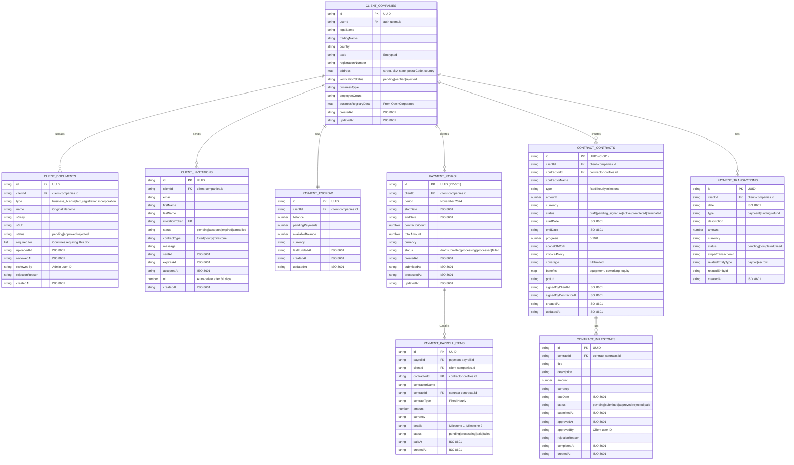
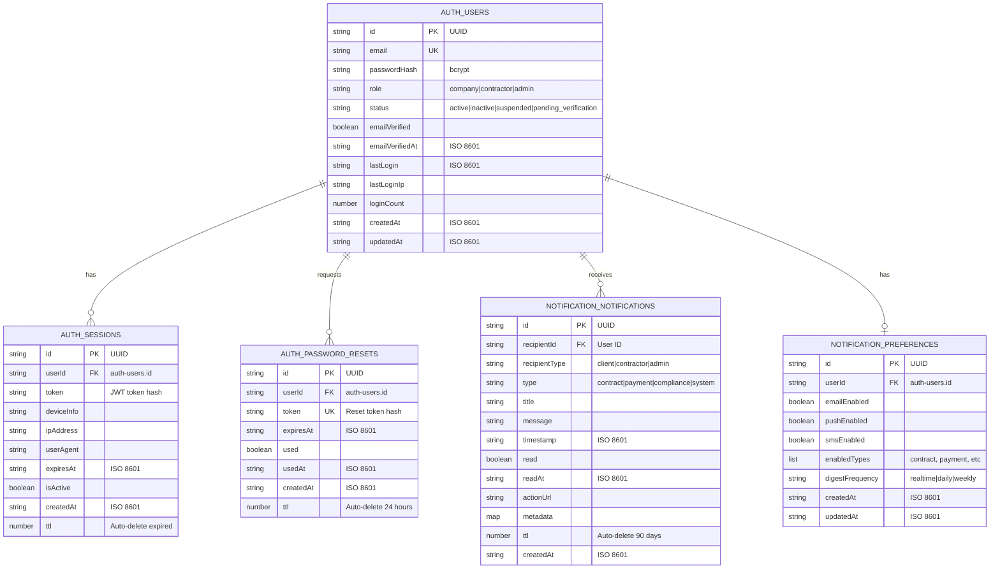

# Mind-Links Platform - Database Schemas (Mermaid ER Diagrams)

This document contains Entity-Relationship diagrams for all DynamoDB tables across the three main dashboards.

---

## 1. Contractor Dashboard Database Schema


---

## 2. Client Dashboard Database Schema



---

## 3. Admin Dashboard Database Schema

```mermaid
erDiagram
    ADMIN_USERS {
        string id PK "UUID"
        string email UK
        string name
        string passwordHash "bcrypt"
        string role "super_admin|compliance_admin|support_admin|finance_admin"
        string status "active|inactive|suspended"
        list permissions "Granular permissions"
        string lastLogin "ISO 8601"
        number actionsCount
        boolean mfaEnabled
        string mfaSecret "Encrypted"
        string createdAt "ISO 8601"
        string updatedAt "ISO 8601"
        string createdBy "Admin who created"
    }

    ADMIN_COUNTRY_RULES {
        string countryCode PK "ISO 3166-1 alpha-2"
        string countryName
        list requiredDocuments "Passport, Tax ID, etc"
        list optionalDocuments "Bank Statement, etc"
        string currency "ISO 4217"
        list taxRequirements
        string specialRequirements
        boolean isActive
        string createdAt "ISO 8601"
        string updatedAt "ISO 8601"
        string updatedBy "Admin ID"
    }

    ADMIN_SYSTEM_ALERTS {
        string id PK "UUID"
        string type "error|warning|info"
        string title
        string message
        string timestamp "ISO 8601"
        boolean resolved
        string resolvedAt "ISO 8601"
        string resolvedBy "Admin ID"
        string resolution
        string relatedEntityType "document|payroll|client"
        string relatedEntityId
        number ttl "Auto-delete 90 days"
    }

    ADMIN_SETTINGS {
        string id PK "UUID"
        string settingKey UK
        string settingValue
        string category "notifications|security|platform"
        string dataType "string|number|boolean|json"
        string description
        string updatedAt "ISO 8601"
        string updatedBy "Admin ID"
    }

    AUDIT_LOGS {
        string id PK "UUID"
        string timestamp SK "ISO 8601"
        string adminId FK "admin-users.id"
        string adminName
        string adminEmail
        string action "document_approved|client_suspended|etc"
        string entityType "document|client|contractor|payroll"
        string entityId
        string entityName
        map details "Action-specific details"
        string ipAddress
        string userAgent
        string sessionId
        string createdAt "ISO 8601"
    }

    AUDIT_EVENTS {
        string id PK "UUID"
        string timestamp SK "ISO 8601"
        string eventType "system_error|security_alert|etc"
        string source "Service name"
        string severity "low|medium|high|critical"
        string message
        map details
        string stackTrace "For errors"
        boolean resolved
        number ttl "Auto-delete 365 days"
    }

    QLDB_LEDGER_ENTRIES {
        string id PK "UUID"
        string transactionType "ledger_adjustment|payment_approval|refund"
        string adminId FK "admin-users.id"
        string contractorId FK "contractor-profiles.id"
        number amount
        string currency
        number balanceBefore
        number balanceAfter
        string reason
        map metadata "Immutable record"
        string timestamp "ISO 8601"
    }

    ADMIN_USERS ||--o{ AUDIT_LOGS : "creates"
    ADMIN_USERS ||--o{ QLDB_LEDGER_ENTRIES : "authorizes"
    ADMIN_USERS ||--o{ ADMIN_SYSTEM_ALERTS : "resolves"
```

---

## 4. Shared/Core Tables (Used Across All Dashboards)



---

## 5. Complete Platform ERD (High-Level Overview)


---

## Table Summary by Service

### Auth Service Tables
| Table | Purpose | GSIs |
|-------|---------|------|
| `auth-users` | User accounts | email-index, role-index |
| `auth-sessions` | Active sessions | userId-index |
| `auth-password-resets` | Reset tokens | userId-index, token-index |

### Contractor Service Tables
| Table | Purpose | GSIs |
|-------|---------|------|
| `contractor-profiles` | Contractor data | userId-index, email-index |
| `contractor-bank-details` | Bank accounts | contractorId-index |
| `contractor-tax-info` | Tax documents | contractorId-index |
| `contractor-wallet` | Balance tracking | contractorId-index |

### KYC Service Tables
| Table | Purpose | GSIs |
|-------|---------|------|
| `kyc-sessions` | Verification sessions | contractorId-index, status-index |
| `kyc-documents` | Uploaded documents | contractorId-index, status-index |

### Client Service Tables
| Table | Purpose | GSIs |
|-------|---------|------|
| `client-companies` | Company profiles | userId-index |
| `client-documents` | Business documents | clientId-index, status-index |
| `client-invitations` | Contractor invites | clientId-index, email-index |

### Contract Service Tables
| Table | Purpose | GSIs |
|-------|---------|------|
| `contract-contracts` | All contracts | clientId-index, contractorId-index, status-index |
| `contract-milestones` | Milestone tracking | contractId-index, status-index |
| `contract-timesheets` | Hourly tracking | contractId-index, contractorId-index |

### Payment Service Tables
| Table | Purpose | GSIs |
|-------|---------|------|
| `payment-escrow` | Client escrow | clientId-index |
| `payment-payroll` | Payroll runs | clientId-index, status-index |
| `payment-payroll-items` | Line items | payrollId-index, contractorId-index |
| `payment-invoices` | Contractor invoices | contractorId-index, contractId-index |
| `payment-withdrawals` | Withdrawal requests | contractorId-index, status-index |
| `payment-transactions` | Transaction history | clientId-index, type-index |

### Admin Service Tables
| Table | Purpose | GSIs |
|-------|---------|------|
| `admin-users` | Admin accounts | email-index, role-index |
| `admin-country-rules` | Country config | - |
| `admin-system-alerts` | System alerts | resolved-index, type-index |
| `admin-settings` | Platform config | settingKey-index |

### Audit Service Tables
| Table | Purpose | GSIs |
|-------|---------|------|
| `audit-logs` | Admin actions | adminId-timestamp-index, action-timestamp-index |
| `audit-events` | System events | eventType-timestamp-index, severity-timestamp-index |
| `qldb-ledger` (QLDB) | Immutable records | - |

### Notification Service Tables
| Table | Purpose | GSIs |
|-------|---------|------|
| `notification-notifications` | All notifications | recipientId-index, type-index |
| `notification-preferences` | User preferences | userId-index |

---

## Total Tables Summary

| Dashboard | New Tables | Shared Tables | Total |
|-----------|------------|---------------|-------|
| Contractor | 8 | 6 | 14 |
| Client | 7 | 6 | 13 |
| Admin | 6 | 6 | 12 |
| **Platform Total** | **21 unique tables** | **+1 QLDB Ledger** |

---

**Document Version:** 1.0  
**Last Updated:** 2025-01-XX
